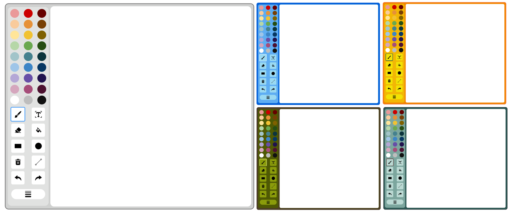

# Simple Canvas Tool

The **Simple Canvas Tool** is a versatile and easy-to-use drawing tool for websites. It provides various drawing tools and features, making it suitable for creating and editing images directly in the browser.


## Features

- **Brush Tool**: Draw freehand lines with adjustable thickness.
- **Eraser Tool**: Erase parts of your drawing.
- **Text Tool**: Add text to your canvas.
- **Bucket Tool**: Fill areas with a selected color.
- **Shape Tools**: Draw rectangles, circles, and hollow versions of these shapes.
- **Clear Tool**: Clear the entire canvas.
- **Undo/Redo**: Undo and redo your actions.
- **Stroke Thickness**: Adjust the thickness of the brush and other tools.

## Installation

To use the **Simple Canvas Tool** in your project, follow these steps:

1. Clone the repository or download the source code.
2. Include the `canvas-draw.js` file in your HTML file.

```html
<script src="canvas-draw.js"></script>
```

If you are using **React**, you can export and import it into your app:

```javascript
// Export the Simple_Draw class
export default Simple_Draw;

// Import the Simple_Draw class in your React component
import Simple_Draw from './path/to/canvas-draw.js';
import { useEffect } from 'react';

const CanvasComponent = () => {
    useEffect(() => {
        new Simple_Draw('canvas-container');
    }, []);

    return (
        <div>
            <h2>Draw on the Canvas</h2>
            <div id="canvas-container"></div>
        </div>
    );
};

export default CanvasComponent;
```

## Usage

To initialize the canvas tool, create a new instance of the `Simple_Draw` class and pass the ID of the container element where you want the canvas to be placed.

```html
<!DOCTYPE html>
<html lang="en">
<head>
    <meta charset="UTF-8">
    <meta name="viewport" content="width=device-width, initial-scale=1.0">
    <title>Canvas Draw Test</title>
</head>
<body>
    <h2>Draw on the Canvas</h2>
    <div id="canvas-container"></div>

    <script src="canvas-draw.js"></script>
    <script>
        new Simple_Draw('canvas-container');
    </script>
</body>
</html>
```

## API

### `Simple_Draw`

#### Constructor

```javascript
new Simple_Draw(containerId, resolution = 540, scale = 0.5, maxHistory = 51)
```

- `containerId` *(string)*: The ID of the container element where the canvas will be placed.
- `resolution` *(number)*: The resolution of the canvas. Default is **540**.
- `scale` *(number)*: The scale of the canvas. Default is **0.5**.
- `maxHistory` *(number)*: The maximum number of undo steps. Default is **51**.

#### Methods

- **`getCanvasImage()`**: Returns a base64-encoded image string of the canvas.

### Example

```html
<!DOCTYPE html>
<html lang="en">
<head>
    <meta charset="UTF-8">
    <meta name="viewport" content="width=device-width, initial-scale=1.0">
    <title>Canvas Draw Example</title>
</head>
<body>
    <h2>Draw on the Canvas</h2>
    <div id="canvas-container"></div>
    <button id="showImageBtn">Show Canvas Image</button>
    <div id="image-container"></div>

    <script src="canvas-draw.js"></script>
    <script>
        const drawApp = new Simple_Draw('canvas-container');

        function updateCanvasImage() {
            const canvasImage = drawApp.getCanvasImage();
            const imgElement = document.createElement('img');
            imgElement.src = canvasImage;
            
            const imageContainer = document.getElementById('image-container');
            imageContainer.innerHTML = '';
            imageContainer.appendChild(imgElement);
        }

        document.getElementById('showImageBtn').addEventListener('click', updateCanvasImage);
    </script>
</body>
</html>
```

## License

This project is licensed under the **MIT License**.

---

This README provides an overview of the **Simple Canvas Tool**, including its features, installation instructions, usage examples, and API documentation. It also includes instructions for using the `Simple_Draw` class in a React application.

